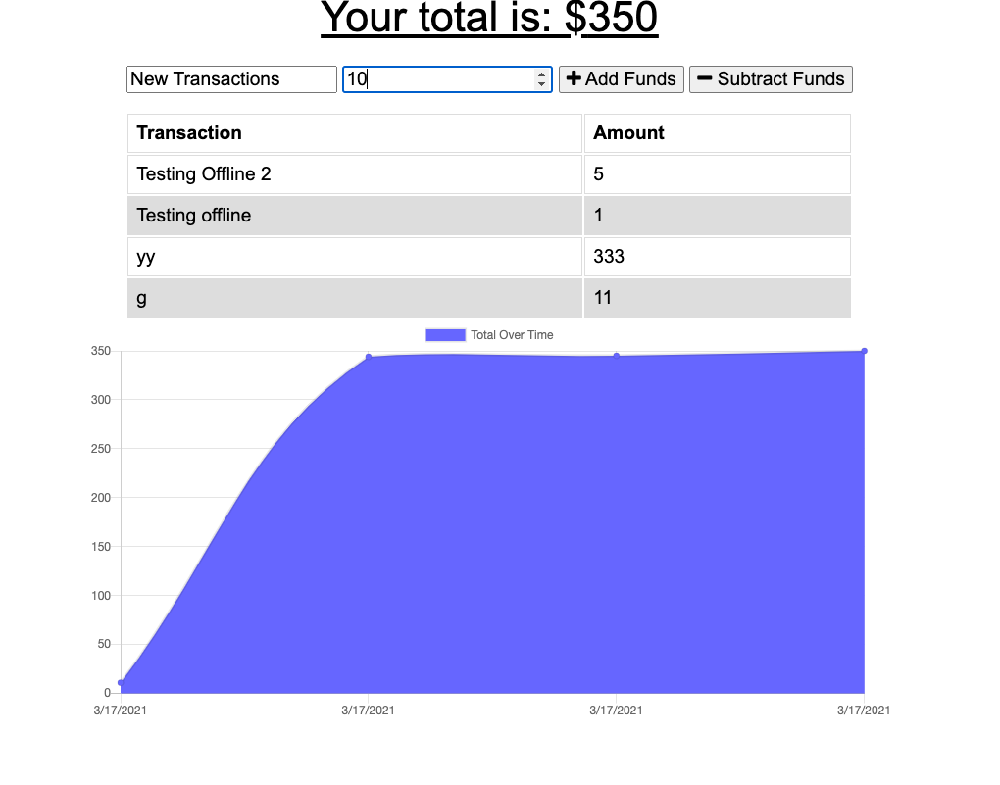
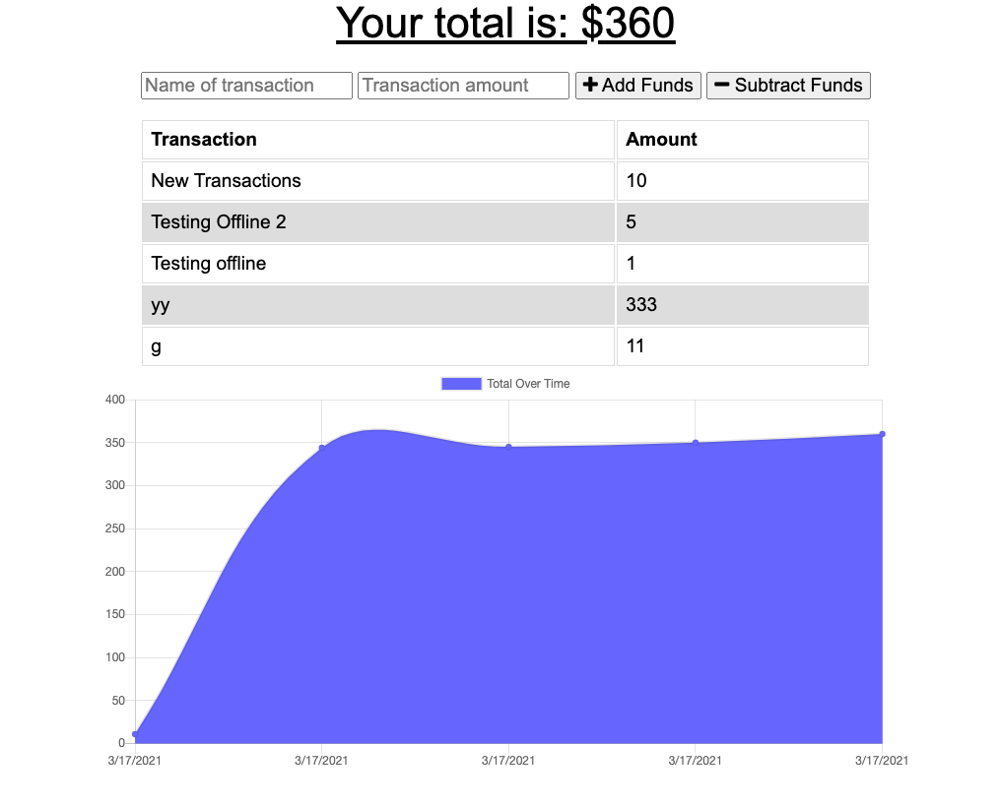
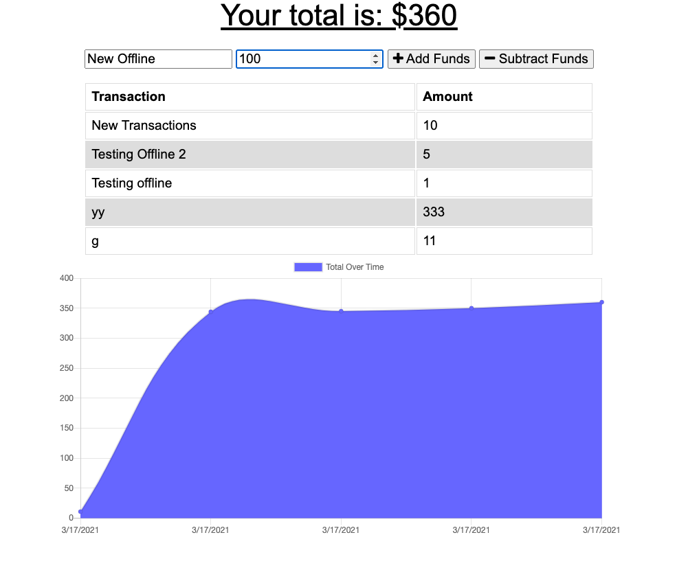
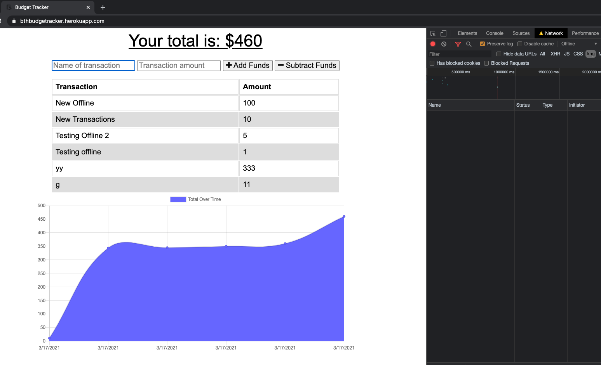
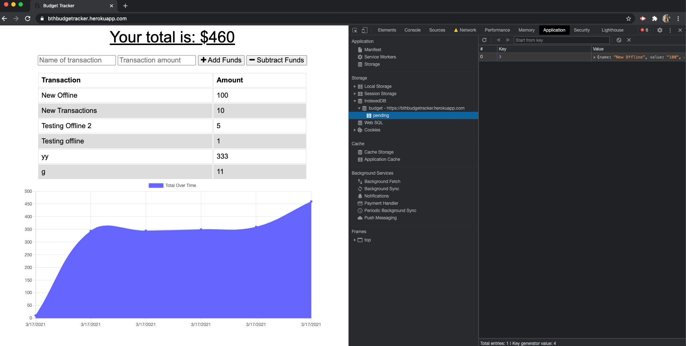

# Budget Tracker 
  

## Table of Contents 
- [Budget Tracker](#budget-tracker)
  - [Table of Contents](#table-of-contents)
  - [Description](#description)
  - [Installation Instructions](#installation-instructions)
  - [Usage](#usage)
  - [Licensing](#licensing)
  - [Contributing](#contributing)
  - [Tests Code](#tests-code)
  - [Images of the Appliication](#images-of-the-appliication)
  - [Access to Functional Applicaton](#access-to-functional-applicaton)
  - [Questions](#questions)
    
## Description
    This application is a simple budget tracker that will log an entry for each transaction you enter either positive or negative.  The application also sums the total amount logged at the top and shows a handy chart at the bottom of the application of the fluctuations in total amounts.  The application will function both online and offline based on data entered.
    
## Installation Instructions 
    There are no specific installation instructions.  The application is live on heroku and can be accessed via the link below and run.  Should you wish to run on your local machine please pull the files from github (link below).  Once you have the files, run a git init in the root folder as well as npm install then run node server.js to get the app running.

## Usage
    To use the application enter the name of the transaction in the box requesting this information and provide the dollar amount for the transaction being entered.  Hit the add or subtract funds buttons and the amount will either be added or removed from your total at the top of the page.  The transaction will be logged to the list and the graph below will update based on the amount.
    
## Licensing
      

    
## Contributing
    All contributions that will improve this application are welcome.
    
## Tests Code
    To test, open the application in chrome using the heroku link below.  Add your transaction and hit the add or remove buttons.  You should see the amount added to the list and your total change by the amount, the chart will update as well.  Now if you use the developer tools and turn off the network in the 'Network' tab (depending on version you may need to select Offline), you should be able to add another transaction using the same process described in the prior step.  The amounts should update and the total amount will remain on your screen.  Once you go back online you can refresh your page and you will see that your new amounts entered while offline remain in the list.
    

## Images of the Appliication
Please find screenshots and a brief video showcasing the application below

## Access to Functional Applicaton

A functioning version of the application can be found here [Heroku](https://bthbudgetracker.herokuapp.com)

## Questions
    
You can find me here on [GitHub](http://github.com/daze77), or contact me via [email](mailto:daze77@gmail.com)  
    